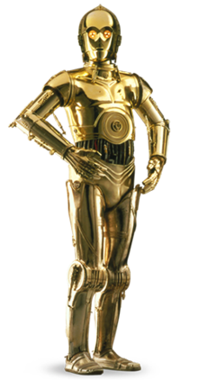

# Exploratory Data Analysis

For this section, we will begin exploring our transformed dataset. The approach here is to get a feel for, understand and pick out key trends and points in our data, such as *outlier* observations which we would like to remove later when modelling our time-series data.

Moreover, we would like to find candidate *break-points* which we can test for a **structural break** at.

Thus, we want to do as the wise Bruce Lee suggests...

***

## ACF and PACF plots

Once we have explored our data

### Adding images

You can reference external media like images from your markdown file. If you use
relative paths, then they will continue to work when the markdown files are copied over,
so long as they point to a file that's inside of the repository.

Here's an image relative to the site root

### Adding movies

You can even embed references to movies on the web! For example, here's a little gif for you!

This will be included in your website when it is built.